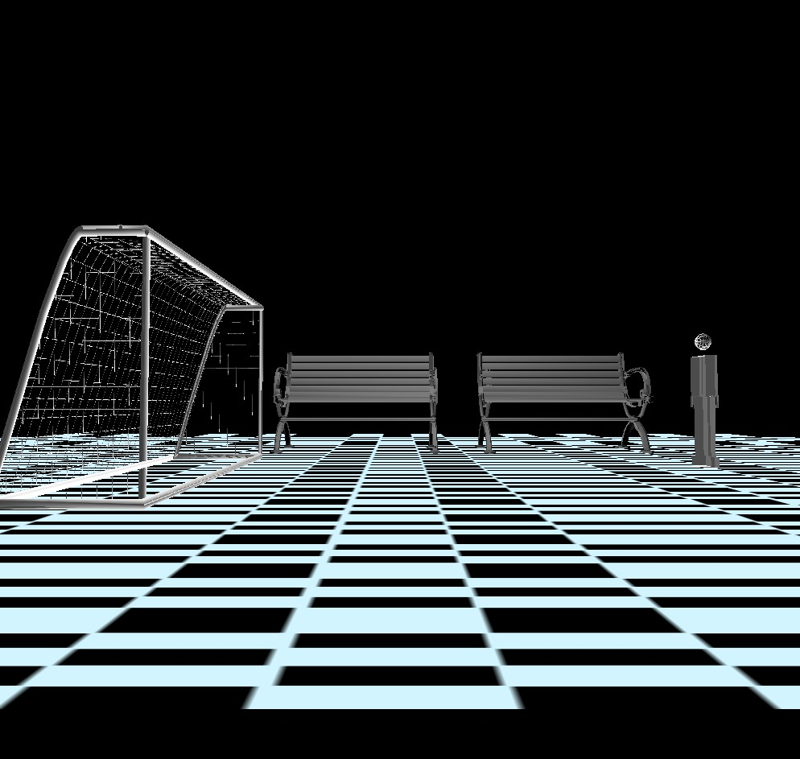
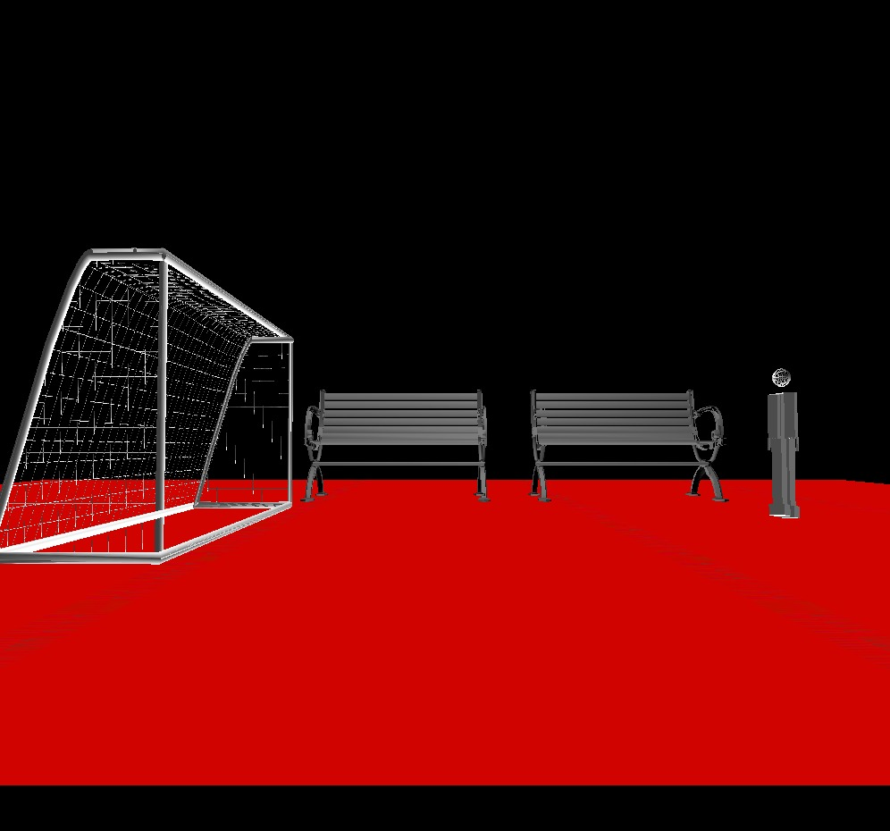
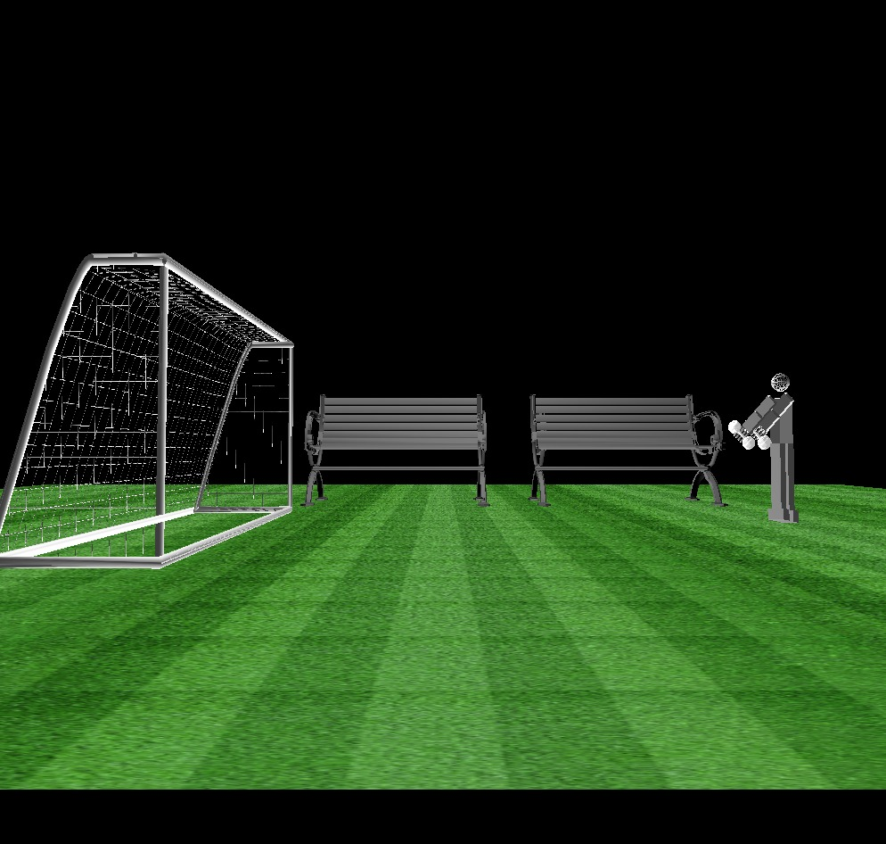
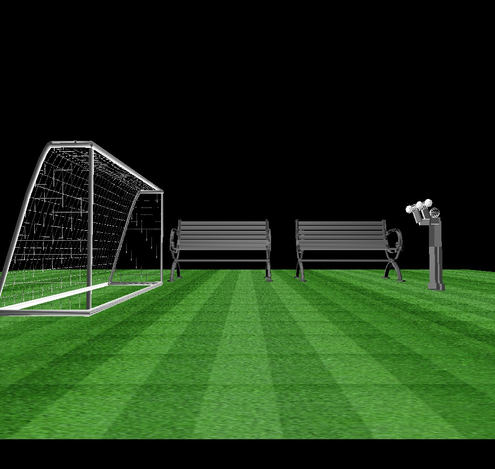
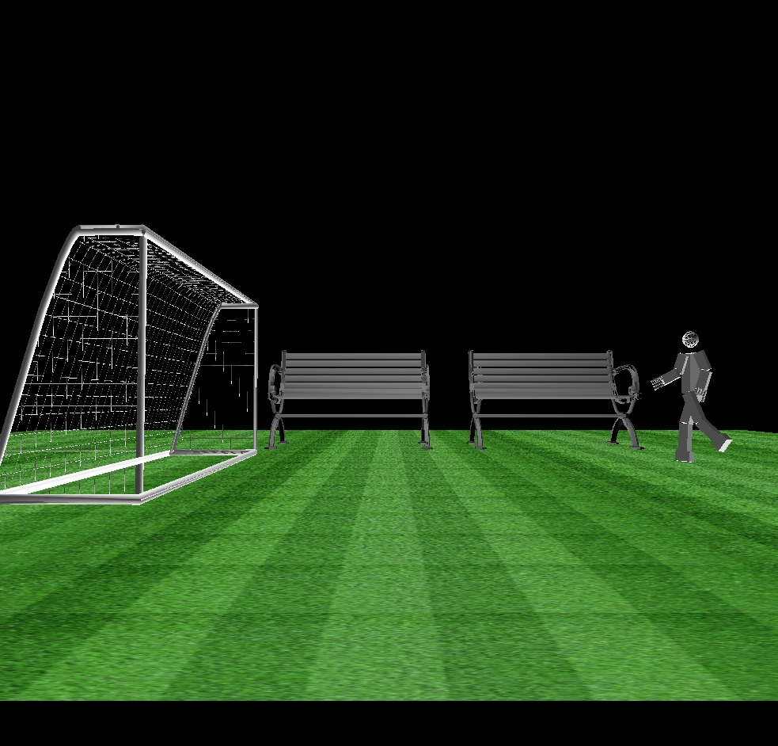
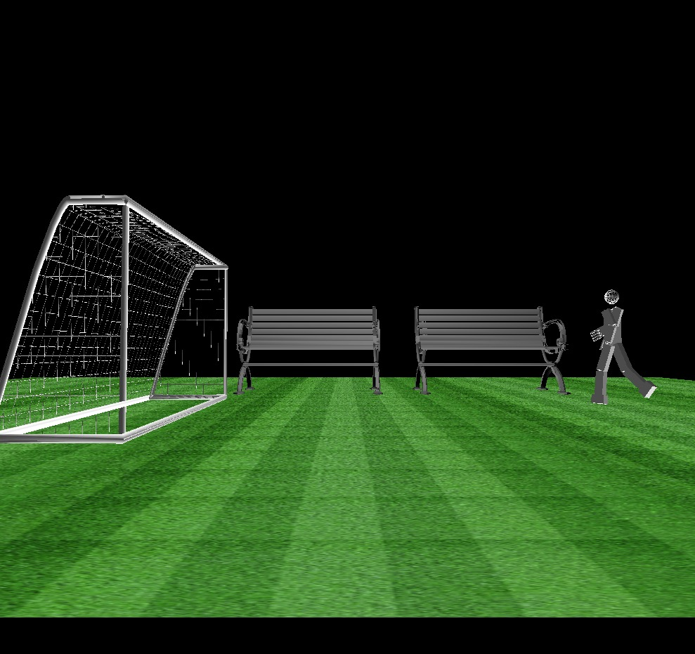
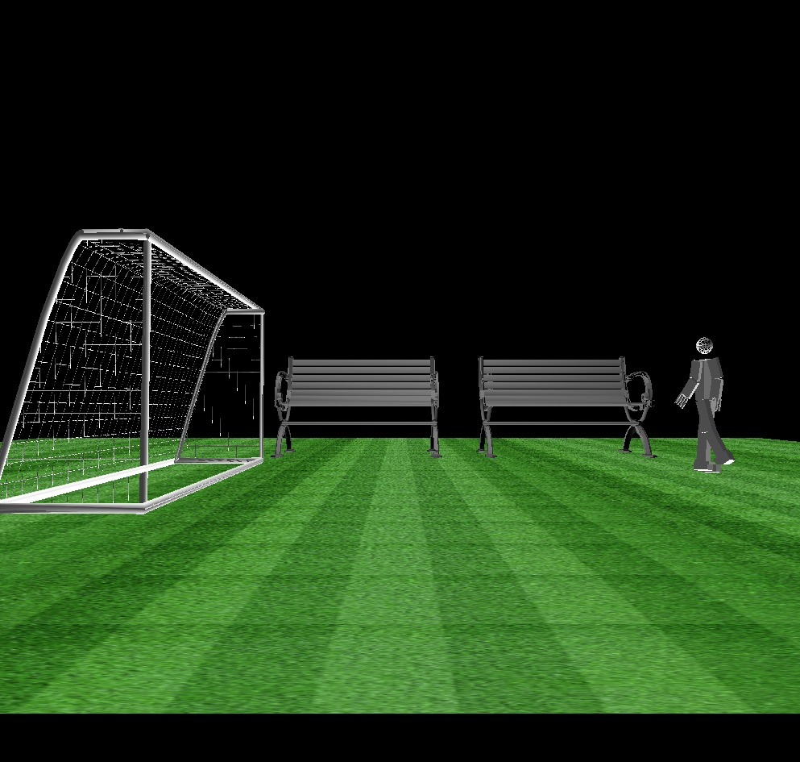
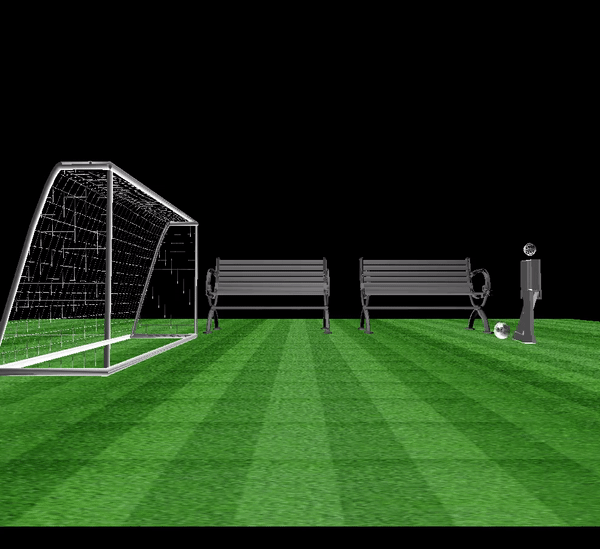

# **Final Assessment Research Project**

                                    Team Members 
                    
        Alaa Gamal                  SEC: 1 BN:          Email: 
                            
        Salma Hamza                 SEC: 1 BN: 38       Email: salmahamza108@gmail.com
        
        Marwa Adel                  SEC:  BN:           Email: 

---
<!-- # Description  -->


# Code  Implementation 

## Variables
Firstly, we import some header files we used and declared some variable that will used in movement of the robot.

```
    #include <GL/glut.h>
    #include <math.h>
    #include "glm.h"
    #include "imageloader.h"
    #define RED 1
    #define GRASS 2
    #define BLACKANDWHITE 3
    #define WALKING 5
    #define ARMS 6
    #define INTERACTING 4
    #define STOP 7
    static int rightShoulderx = 0 ,rightShoulderz = 0 ,leftShoulderx = 0, leftShoulderz = 0, rightElbow = 0,leftElbow = 0, rightKnee = 0, leftKnee = 0, rightHipx=0,rightHipz=0, leftHipx=0, leftHipz=0, rightFingerBase = 0, rightFingerUp = 0, leftFingerBase = 0, leftFingerUp = 0;
```
then,declared some variable to control camera intital position.

```
    double eye[] = { 25, 0, 0 };
    double center[] = { 0, 1, 0 };
    double up[] = { 0, 1, 0 };
```

To design animation we used these variables , we creat some posoes for the three required animation, we will explain all detials and results.

```
    // flages we will explain how we use then later on.

        int frame =0 ; 
        int walking = 0;
        int arms = 0;
        int interacting = 0;           
    // variable that used in move ball 

        static int ballAngle=0;

    // for each pose in walkingPose 
        {rightHipx ,rightKnee,leftHipx,leftKnee,leftShoulderx,leftElbow,rightShoulderx,rightElbo}
    int WalkingPoses[8][8]={{15,15,-10,5,15,-25,-10,-25},
                {25,25,-20,15,25,-45,-20,-45},
                {15,15,-10,5,15,-25,-10,-25},
                {0,0,0,0,0,0,0,0},{-10,5,15,15,-10,-25,15,-25},{-20,15,25,25,-20,-45,25,-45},{-10,5,15,15,-10,-25,15,-25},{0,0,0,0,0,0,0,0}};

    // for each pose in ArmPoses
    int ArmPoses[10][4]={{-45,-45,0,0},{-90,-90,0,0},{-90,-90,-35,-35},{-90,-90,-70,-70},{-90,-90,-110,-110},
                {-90,-90,-70,-70},{-90,-90,-35,-35},{-90,-90,0,0},{-45,-45,0,0},{0,0,0,0}};

    // for each pose in BallPoses           
    int BallPoses[8][3]={{45,0,0},{90,0,0},{45,0,0},{0,0,0},{0,-20,-40},{0,-40,-80},{0,-20,-40},{0,0}};

```
Control lighting

```
        // RGBA
        GLfloat light_ambient[] = { 1.0, 1.0, 1.0, 1.0 };
        GLfloat light_ambient1[] = { 0.0, 0.0, 0.0, 0.0 };
        GLfloat light_diffuse[] = { 0.5, 0.5, 0.5,1.0 };
        GLfloat light_specular[] = {1.0, 1.0, 1.0, 1.0 };
        // x , y, z, w
        GLfloat light_position[] = {0.5,10.0, 0.0, 1.0 };
        GLfloat lightPos1[] = {-0.5,-5.0,-2.0, 1.0 };
        // Material Properties
        GLfloat mat_amb_diff[] = {0.643, 0.753, 0.934, 1.0 };
        GLfloat mat_specular[] = { 0.0, 0.0, 0.0, 1.0 };
        GLfloat shininess[] = {100.0 };  
        //left teapot specular
        GLfloat teapotl_diff[] = { 0.0,0.0, 1.0, 1.0 };
        GLfloat teapotl_specular[] = {1.0, 1.0, 1.0, 1.0 };
        GLfloat teapotl_shininess[] = {10.0 };  
        //middle teapot diffuse
        GLfloat teapotm_diff[] = { 1.0, 0, 0.0, 1.0 };
        GLfloat teapotm_specular[] = { 0.0, 0.0, 0.0, 0.0 };
        GLfloat teapotm_shininess[] = {1.0 };  
        //right teapot glosy
        GLfloat teapotr_diff[] = { 1.0, .0, 0.0, 1.0 };
        GLfloat teapotr_specular[] = { 1.0, 1.0, 1.0, 1.0 };
        GLfloat teapotr_shininess[] = {1000.0 };  
        //cube
        GLfloat cube_diff[] = {1.0,0.0, 0.0, 1.0 };
        GLfloat cube_specular[] = { 0.5, 0.5, 0.5, 1.0 };
        GLfloat cube_shininess[] = {10.0 }; 


```
## Functions 

LoadTexture Function *it takes the image that will used as a floor* 

```

        GLuint loadTexture(Image* image) {
            GLuint textureId;
            glGenTextures(1, &textureId);                         //Make room for our texture
            glBindTexture(GL_TEXTURE_2D, textureId);               //Tell OpenGL which texture to edit
            //Map the image to the texture
            glTexImage2D(GL_TEXTURE_2D,                            //Always GL_TEXTURE_2D
                                    0,                            //0 for now
                                    GL_RGB,                       //Format OpenGL uses for image
                                    image->width, image->height,  //Width and height
                                    0,                            //The border of the image
                                    GL_RGB,                       //GL_RGB, because pixels are stored in RGB format
                                    GL_UNSIGNED_BYTE,            //GL_UNSIGNED_BYTE, because pixels are stored
                                                                //as unsigned numbers
                                    image->pixels);               //The actual pixel data
            return textureId;                                     //Returns the id of the texture
}
```
we used drop menu to select which image we want to use in texture mapping.

```
void processMenuEvents(int option) {
        switch (option) {
        case RED :
            image = loadBMP("RED.bmp");
            _textureId = loadTexture(image);
        delete image;
        break;
        case GRASS :
            image = loadBMP("grass.bmp");
            _textureId = loadTexture(image);
        delete image;
            break;
        case BLACKANDWHITE :
            image = loadBMP("floor.bmp");
            _textureId = loadTexture(image);
            delete image; break;
        case WALKING :
            walking = 1,arms = 0 , interacting = 0;
            break;
        case ARMS :
            arms =1, walking = 0 , interacting = 0;
            break;
        case INTERACTING :
            interacting =1 , arms = 0 , walking = 0;
            break;
        case STOP :
            walking = 0 , arms = 0 , interacting = 0;
            break;
        }
}
   
```
As shown we don't use drop menu to change the Texture mapping but also to choose one of three scenes we created .

To make these scenes we used 4 objects: 
- Ball
- football goal
- dumbbell
- Bench

we put these objects in display function.
```
void display(void)
{
	glClear(GL_COLOR_BUFFER_BIT );
    glClearColor(0.0, 0.0, 0.0, 0.0);
	glShadeModel(GL_FLAT);
	glMatrixMode(GL_MODELVIEW);
	glLoadIdentity();
	gluLookAt(eye[0], eye[1], eye[2], center[0], center[1], center[2], up[0], up[1], up[2]);
    glPushMatrix();
        glLightfv(GL_LIGHT1, GL_POSITION, lightPos1);
        glLightfv(GL_LIGHT0, GL_POSITION, light_position);
        glPopMatrix();
        //materials properties
        glMaterialfv(GL_FRONT_AND_BACK, GL_AMBIENT_AND_DIFFUSE,mat_amb_diff);
        glMaterialfv(GL_FRONT, GL_SPECULAR, mat_specular);
        glMaterialfv(GL_FRONT, GL_SHININESS, shininess);
	glPushMatrix();
    glPushMatrix();
	glEnable(GL_TEXTURE_2D);
    glScalef(0.5,0.5,0.5);
        glBindTexture(GL_TEXTURE_2D, _textureId);

        glTexParameteri(GL_TEXTURE_2D, GL_TEXTURE_MIN_FILTER, GL_NEAREST);
        glTexParameteri(GL_TEXTURE_2D, GL_TEXTURE_MAG_FILTER, GL_NEAREST);
        glTexParameteri(GL_TEXTURE_2D, GL_TEXTURE_MIN_FILTER, GL_LINEAR);
        glTexParameteri(GL_TEXTURE_2D, GL_TEXTURE_MAG_FILTER, GL_LINEAR);

        glBegin(GL_QUADS);
       
	glNormal3f(0.0,-1.0,0.0);
	glTexCoord2f(0.0f, 0.0f);
        glVertex3f(-40.0f, -5.0f, -60.0f);
        glTexCoord2f(5.0f,  0.0f);
        glVertex3f(-40.0f, -5.0f,  60.0f);
        glTexCoord2f(5.0f,  20.0f);
        glVertex3f( 40.0f, -5.0f,  60.0f);
        glTexCoord2f(0.0f, 20.0f);
        glVertex3f( 40.0f, -5.0f, -60.0f);
        glEnd();
	glDisable(GL_TEXTURE_2D);
    glPopMatrix();
	glTranslatef(0.5,1.0,0.0);
	glScalef(0.85,0.85,0.85);

	glRotatef(angle2, 1.0, 0.0, 0.0);
	glRotatef(angle, 0.0, 1.0, 0.0);

	//draw body
	glTranslatef (-1.0, 0.0, -17.0);
    glPushMatrix();
   
    glTranslatef(0,0,30);
    glScalef(60,80,60);
    drawmodel1("data/football goal.obj",pmodel2);

    glPopMatrix();
    glPushMatrix();
   
	glScalef (1.1, 2.0, 0.5);
	glutSolidCube (1.0);
   
	glPopMatrix();

	//draw head

	glTranslatef (0.0, 1.7, 0.0);
	glPushMatrix();
	glutWireSphere (0.4,8.0,8.0);
	glPopMatrix();

	
    glPushMatrix();
    glTranslatef (0.75, -1.2, 0.0);
    RightArm();
    if(arms==1)
    { glPushMatrix();
    glTranslatef(0,-0.8,0);
    glRotatef((GLfloat)90,0.0,1.0,0.0);

    glScalef(5,5,5);
    drawmodel1("data/dumbbell.obj",pmodel5);

    glPopMatrix();}
    glPopMatrix();


    glPushMatrix();
    glTranslatef (-0.75, -1.2, 0.0);
    LeftArm();
   if(arms==1)
   {
        glPushMatrix();
   glTranslatef(0,-0.8,0);
   glRotatef((GLfloat) 90,0.0,1.0,0.0);
   
   glScalef(5,5,5);
   drawmodel1("data/dumbbell.obj",pmodel6);

   glPopMatrix();
   }
	glPopMatrix();

	glPushMatrix();
	glTranslatef (0.25, -3.5, 0.0);
	RightLeg();
	glPopMatrix();

	glPushMatrix();
	glTranslatef (-0.25, -3.5, 0.0);
	LeftLeg();
	glPopMatrix();

	glPopMatrix();
   if (interacting == 1){
   glPushMatrix();
   glTranslatef(0.0,-0.8,-14.0);
   glRotatef((GLfloat) ballAngle,1.0,0.0,0.0);
   glTranslatef(0.2,-2,0.5);
   glScalef(3,3,3);
   drawmodel1("data/soccerball.obj",pmodel1);

   glPopMatrix();
   }
   
   glPushMatrix();
   glTranslatef(-15,0,3);
   glRotatef((GLfloat) 90,0.0,1.0,0.0);
   // glTranslatef(0.0,-0.8,0.0);
   
   glScalef(40,40,40);
   drawmodel1("data/Bench_LowRes.obj",pmodel3);

   glPopMatrix();
   glPushMatrix();
   glTranslatef(-15,0,-12);
   glRotatef((GLfloat) 90,0.0,1.0,0.0);
   // glTranslatef(0.0,-0.8,0.0);
   
   glScalef(40,40,40);
   drawmodel1("data/Bench_LowRes.obj",pmodel4);

   glPopMatrix();
   
	glPopMatrix();
	glutSwapBuffers();
}
```
to draw any object we use drawmodel function.

```
void drawmodel1(char* path,GLMmodel* pmodel)
{
	if (!pmodel) {
		pmodel = glmReadOBJ(path);

		if (!pmodel) exit(0);
		glmUnitize(pmodel);
		glmFacetNormals(pmodel);
		glmVertexNormals(pmodel, 90.0);
		glmScale(pmodel, .15);
       // Turn on the power
        glEnable(GL_LIGHTING);
        // Flip light switch
        glEnable(GL_LIGHT0);
        glEnable(GL_LIGHT1);
        // assign light parameters
        glLightfv(GL_LIGHT0, GL_AMBIENT, light_ambient);
        glLightfv(GL_LIGHT0, GL_DIFFUSE, light_diffuse);
        glLightfv(GL_LIGHT0, GL_SPECULAR, light_specular);
        glLightfv(GL_LIGHT1, GL_AMBIENT, light_ambient1);
        glLightfv(GL_LIGHT1, GL_DIFFUSE, light_diffuse);
        glLightfv(GL_LIGHT1, GL_SPECULAR, light_specular);
	// Material Properties         
        glMaterialfv(GL_FRONT_AND_BACK, GL_AMBIENT_AND_DIFFUSE,mat_amb_diff);
        glMaterialfv(GL_FRONT, GL_SPECULAR, mat_specular);
        glMaterialfv(GL_FRONT, GL_SHININESS, shininess);
	GLfloat lightColor1[] = {1.0f, 1.0f,  1.0f, 1.0f };
        glLightfv(GL_LIGHT1, GL_DIFFUSE, lightColor1);
        glLightfv(GL_LIGHT1, GL_POSITION, lightPos1);
        glLightfv(GL_LIGHT0, GL_DIFFUSE, lightColor1);
        glEnable(GL_NORMALIZE);
        //Enable smooth shading
        glShadeModel(GL_SMOOTH);
        // Enable Depth buffer
        glEnable(GL_DEPTH_TEST);
      //   startList = glGenLists(4);

	}
	glmDraw(pmodel, GLM_SMOOTH | GLM_MATERIAL);
}

```
Then to finally create the scenes we use the poses Function in this function we check if which flag is 1 . Remember the flag is seted after we choose it from the drop menu.

```
void setPoses(int frame){
   
   if (walking == 1)
   {
   rightHipx = WalkingPoses[frame][0];
   rightKnee = WalkingPoses[frame][1];
   leftHipx = WalkingPoses[frame][2];
   leftKnee = WalkingPoses[frame][3];
   leftShoulderx=WalkingPoses[frame][4];
   leftElbow=WalkingPoses[frame][5];
   rightShoulderx=WalkingPoses[frame][6];
   rightElbow=WalkingPoses[frame][7];

   }
   else if (arms == 1)
   {
   rightShoulderx = ArmPoses[frame][0];
   leftShoulderx = ArmPoses[frame][1];
   rightElbow = ArmPoses[frame][2];
   leftElbow = ArmPoses[frame][3];
   }
   else if(interacting==1)
   {
      rightKnee=BallPoses[frame][0];
      rightHipx=BallPoses[frame][1];
      ballAngle=BallPoses[frame][2];

   }
}

```
this function is called by the Timer function that make these separated poses act like an animation.

```
void timer(int value)
{
    clearRotation();
    if (walking == 1){
        frame = frame % 8;
        setPoses(frame);
        frame++;
    }
    else if (arms == 1)
    {
        frame = frame % 10;
        setPoses(frame);
        frame++;
    }
    else if (interacting == 1)
    {
        frame = frame % 8;
        setPoses(frame);
        frame++;
        
        }
    glutPostRedisplay();
    glutTimerFunc(1, timer, 0);
}

```
The timer function is called by the main function.

*Note: Some functions we don't illustrate them because we already illusrated them in the last assignments*

# Results
- Drop menu


- Texture Mapping options.





- Motions

**1- Move dumbbell**

 

 

**2-kick the ball**


**3-walking**







- Animations

*Kick the ball*



*Walking*


*Move dumpple*


------------
## Application of this project in the Biomedical fields

- we can use it in rehabiliation, This excersises can help the patients to know the way to do the exercises

## Issues 

- we faced some problems at the first to create animation and the robot was move in wrong way and we solve it after watch the section video.

- The lighting was not good at all and we change the constants that control the lighting and solve it.

- The football goal was moving wrong when we move the camera backward or forward and it was a mistake in the position of the object in the display function.

