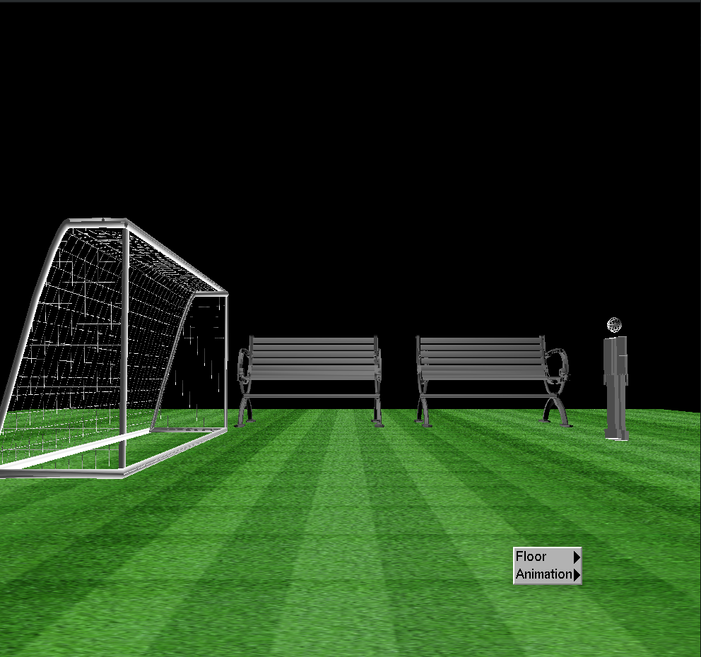
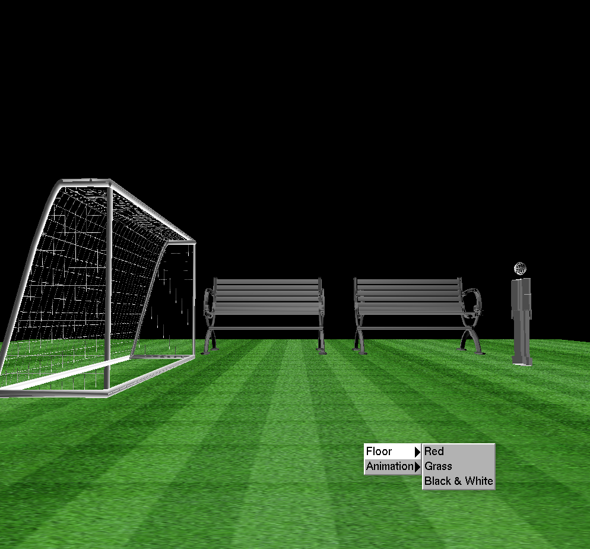
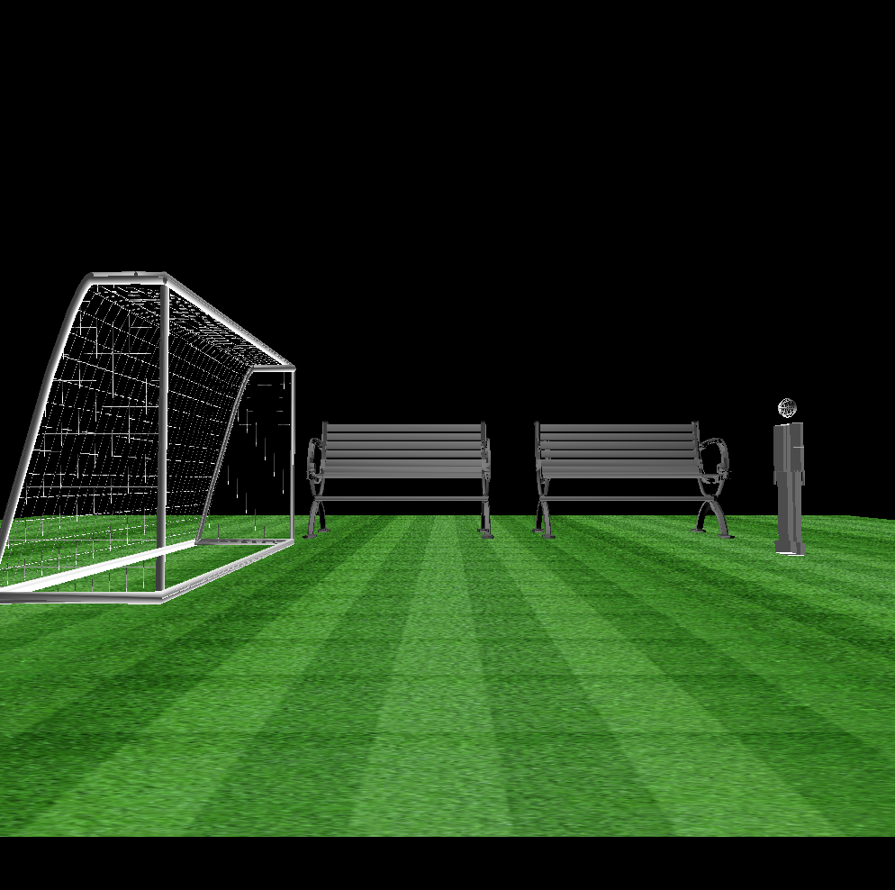
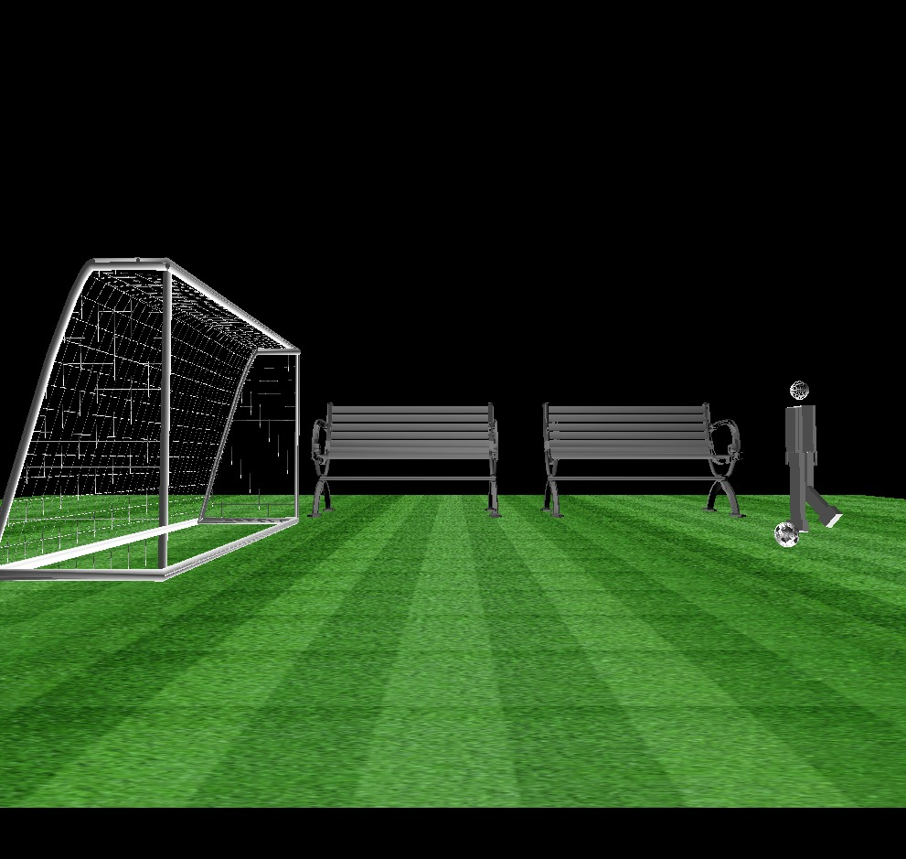
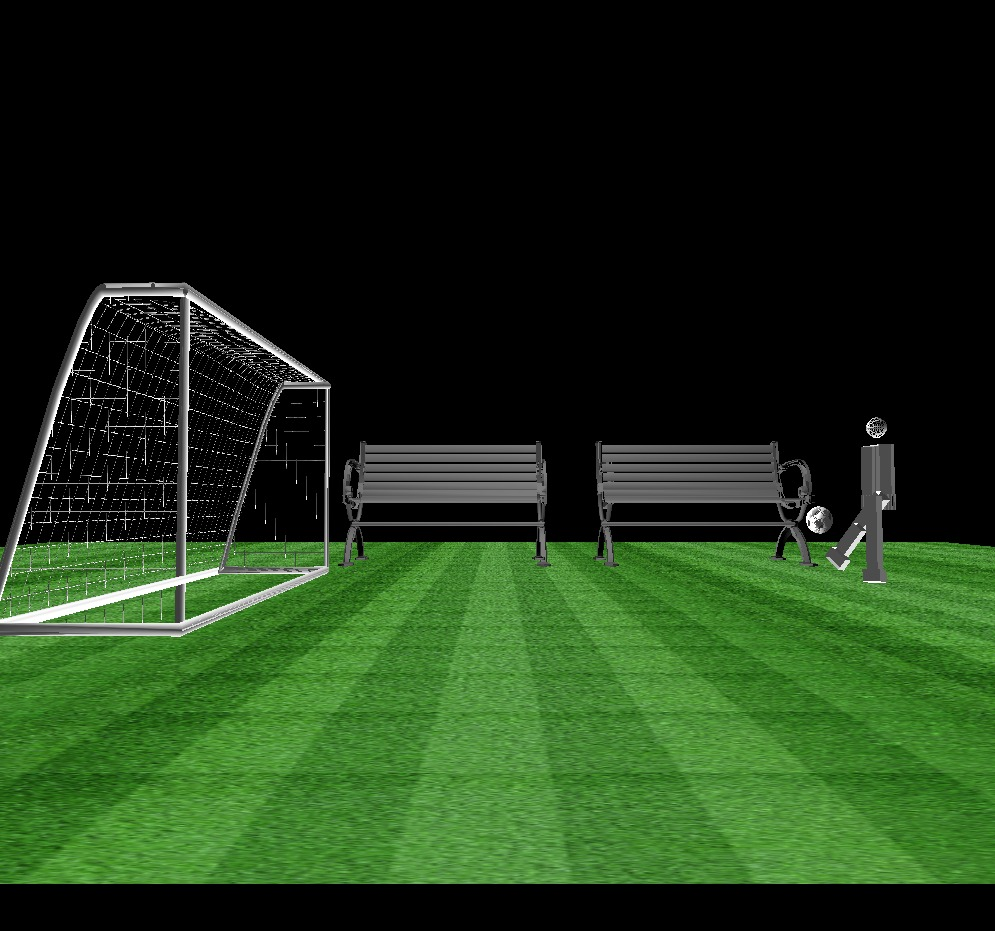

# **Final Assessment Research Project**

                                    Team Members 
                    
        Alaa Gamal                  SEC: 1 BN:          Email: alaagamal.98@gmail.com
                            
        Salma Hamza                 SEC: 1 BN: 38       Email: salmahamza108@gmail.com
        
        Marwa Adel                  SEC:  BN:           Email: marwaayosiif@gmail.com

---
<!-- # Description  -->
# Loaded objects 
we used 4 objects, Ball ,Football goal, dumbbell and Bench

# Results
## - Drop menu

Here we made two submenu,, One to choose the texture mapping acting on the floor and the other to choose the animation you want to dispaly 

- Texture Mapping options.

**1- This is when we choose Black & White**

**2- This is when we choose Grass**

**3- This is when we choose Red**

## - Animations

**1- Kick the ball**

**3- Walking**

**2- Move dumpple**

## - Motions

**1- Move dumbbell**

 

 

**2- Kick the ball**

**3- Walking**

------------
## Application of this project in the Biomedical fields

- we can use it in rehabiliation.

## Issues 

- we faced some problems at the first to create animation and the robot was move in wrong way and we solve it after watch the section video.

- The lighting was not good at all and we change the constants that control the lighting and solve it.

- The football goal was moving wrong when we move the camera backward or forward and it was a mistake in the position of the object in the display function.

